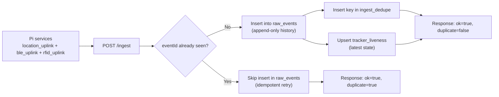

# parcel-tracker-convex

Convex backend for raw parcel-tracker ingest.

This backend is intentionally "raw first": it validates incoming tracker envelopes, deduplicates retries by `eventId`, and stores append-only event history for downstream consumers like dashboards and analytics jobs.

## What this backend does

1. Accepts normalized events via HTTP (`POST /ingest`).
2. Validates event semantics by `eventType`.
3. Enforces contract compatibility (`contractVersion` major check).
4. Deduplicates events by `eventId` (idempotent retries).
5. Stores accepted events in `raw_events` with server ingest timestamp.
6. Maintains a per-tracker last-seen snapshot in `tracker_liveness`.
7. Exposes contract metadata at `GET /contract/version`.

This backend does not do parcel assignment or backtracking logic. It is the durable ingest layer that other services can read from.

## Repository layout

- `package.json`
- `convex/schema.ts`
  - Table definitions and indexes.
- `convex/ingest.ts`
  - Ingest mutation, compatibility checks, semantic validation, dedupe, and liveness updates.
- `convex/http.ts`
  - HTTP routes (`/ingest`, `/contract/version`).
- `convex/trackerPlates.ts`
  - Tracker name to license plate assignment mutation and lookup queries.
- `scripts/smoke_ingest.sh`
  - End-to-end smoke test for contract endpoint, idempotency, and validation.

## Prerequisites

- Node.js 18+
- npm
- Convex account/project access

## Setup

```bash
cd 02_convex_backend
npm install
```

## Deploy

```bash
npm run convex:deploy
```

Important:
- `convex deploy` targets your Convex production deployment for the selected project unless you switch environments.
- Ensure your Pi `INGEST_URL` points to the same deployment you deployed.

## HTTP endpoints

### `POST /ingest`

Ingest one raw event envelope.

Success:
- `200`
- `{ ok: true, duplicate: false|true, rawEventId: "..." }`

Validation or compatibility failure:
- `400`
- `{ ok: false, error: "..." }`

### `GET /contract/version`

Returns current ingest contract metadata.

Example:

```json
{
  "contractVersion": "1.0.0",
  "minCompatibleMajor": 1
}
```

## Tracker Name to License Plate Association

This backend now supports a semi-permanent association between tracker name and
license plate string.

Purpose:
- Keep one current license plate value per Raspberry Pi tracker name.
- Allow filtering by plate first, then fetching events by tracker.

### Storage model

Table: `tracker_plate_assignments`

Fields:
- `trackerName` (`string`): Raspberry Pi tracker name.
- `licensePlate` (`string`): assigned plate value.
- `updatedAtMs` (`number`): last update time (Unix epoch ms).

Indexes:
- `by_tracker_name`
- `by_license_plate`

Behavior:
- Assignment is "upsert-like" per `trackerName`.
- Reassigning a plate for the same tracker updates that tracker's existing row.
- If duplicate rows exist for a tracker name, assignment keeps one and removes extras.

### Convex functions

Module: `convex/trackerPlates.ts`

1. Mutation: `trackerPlates:assignLicensePlate`
- Args:
```json
{ "trackerName": "pi-5-gateway-01", "licensePlate": "ZH123456" }
```
- Returns:
```json
{ "ok": true, "created": true, "id": "..." }
```
or
```json
{ "ok": true, "created": false, "id": "..." }
```

2. Query: `trackerPlates:getByTrackerName`
- Args:
```json
{ "trackerName": "pi-5-gateway-01" }
```
- Returns one mapping row or `null`.

3. Query: `trackerPlates:getByLicensePlate`
- Args:
```json
{ "licensePlate": "ZH123456" }
```
- Returns all matching tracker mappings (array).

### API call examples (`.cloud`)

Assign/update plate:

```bash
curl -sS -X POST https://YOUR_DEPLOYMENT.convex.cloud/api/mutation \
  -H "content-type: application/json" \
  -d '{"path":"trackerPlates:assignLicensePlate","args":{"trackerName":"pi-5-gateway-01","licensePlate":"ZH123456"}}'
```

Lookup trackers by plate (for filtering):

```bash
curl -sS -X POST https://YOUR_DEPLOYMENT.convex.cloud/api/query \
  -H "content-type: application/json" \
  -d '{"path":"trackerPlates:getByLicensePlate","args":{"licensePlate":"ZH123456"}}'
```

### Practical filtering flow

1. Query `trackerPlates:getByLicensePlate` to get tracker names.
2. For each `trackerName`, fetch events from `raw_events` using existing queries
   (for example `queries:getTrackerEventHistory`).
3. Merge/sort results in the dashboard by timestamp as needed.

## Agent integration notes (`.site` vs `.cloud`)

Use different hosts for different APIs:

- `.site` host:
  - Use for custom HTTP routes defined in `convex/http.ts`.
  - In this repo: `POST /ingest`, `GET /contract/version`.
- `.cloud` host:
  - Use for Convex function calls (`/api/query`, `/api/mutation`, `/api/action`).
  - Function names use `module:function` format.

Example:

```bash
# Query call (.cloud)
curl -sS -X POST https://YOUR_DEPLOYMENT.convex.cloud/api/query \
  -H "content-type: application/json" \
  -d '{"path":"queries:getContractVersion","args":{}}'

# Mutation call (.cloud)
curl -sS -X POST https://YOUR_DEPLOYMENT.convex.cloud/api/mutation \
  -H "content-type: application/json" \
  -d '{"path":"ingest:ingestRawEvent","args":{ ... }}'
```

Important:
- `ingest:ingestRawEvent` is a mutation, not a query.
- Calling it via `/api/query` will fail with a runtime type mismatch.

### Public query names for `/api/query`

These are exported in `convex/queries.ts`:

| Query name | Args |
|---|---|
| `queries:getContractVersion` | `{}` |
| `queries:listPublicQueries` | `{}` |
| `queries:getEventById` | `{ "eventId": string }` |
| `queries:listTrackerLiveness` | `{ "trackerId"?: string, "limit"?: number }` |
| `queries:listRecentRawEvents` | `{ "sinceIngestTsMs"?: number, "limit"?: number }` |
| `queries:getTrackerEventHistory` | `{ "trackerId": string, "startTrackerTsMs"?: number, "endTrackerTsMs"?: number, "limit"?: number }` |
| `queries:getEventsByType` | `{ "eventType": "heartbeat" \| "gps_fix" \| "gps_no_fix" \| "gps_cell_fallback" \| "ble_scan" \| "rfid_scan", "startTrackerTsMs"?: number, "endTrackerTsMs"?: number, "limit"?: number }` |
| `queries:getBeaconHistory` | `{ "beaconId": string, "startTrackerTsMs"?: number, "endTrackerTsMs"?: number, "limit"?: number }` |

### One-call query discovery for agents

If your agent should self-discover callable queries and argument shapes, call:

```bash
curl -sS -X POST https://YOUR_DEPLOYMENT.convex.cloud/api/query \
  -H "content-type: application/json" \
  -d '{"path":"queries:listPublicQueries","args":{}}'
```

## Raw event contract (dashboard-facing reference)

This section is the key reference for anyone building a dashboard from `raw_events`.

### Top-level envelope fields

| Field | Type | Required | Notes |
|---|---|---|---|
| `eventId` | `string` | yes | Must be globally unique for idempotency. Duplicate `eventId` is accepted as retry but not reinserted. |
| `contractVersion` | `string` (`x.y.z`) | yes | Major version must match backend `minCompatibleMajor`. |
| `trackerId` | `string` | yes | Tracker identity key. |
| `eventType` | enum | yes | One of: `heartbeat`, `gps_fix`, `gps_no_fix`, `gps_cell_fallback`, `ble_scan`, `rfid_scan`. |
| `trackerTsMs` | `number` | yes | Device timestamp in Unix epoch milliseconds. |
| `seq` | `number` | yes | Per-device sequence number. Useful for gap detection. |
| `beaconId` | `string` | conditional | Required for `ble_scan` and `rfid_scan`. |
| `location` | object | conditional | Required for `gps_fix` and `gps_cell_fallback`. |
| `signal` | object | no | Optional signal telemetry. |
| `status` | object | no | Optional status metadata. |
| `sourcePayload` | `any` | no | Optional raw pass-through payload for debugging. |

### `location` object

| Field | Type | Required | Notes |
|---|---|---|---|
| `lat` | `number` | yes (when `location` exists) | Latitude. |
| `lon` | `number` | yes (when `location` exists) | Longitude. |
| `speedKmh` | `number` | no | Speed in km/h. |
| `altM` | `number` | no | Altitude in meters. |
| `hdop` | `number` | no | GNSS dilution of precision (smaller is better). |
| `method` | enum | yes (when `location` exists) | `gnss` or `cell_lbs_native`. |
| `accuracyM` | `number` | conditional | Required for `gps_cell_fallback`. |
| `source` | `string` | conditional | Must be `sim7670_clbs` for `gps_cell_fallback`. |

### `signal` object

| Field | Type | Required | Notes |
|---|---|---|---|
| `rssi` | `number` | no | Optional received signal strength indicator. |

### `status` object

| Field | Type | Required | Notes |
|---|---|---|---|
| `locationMode` | enum | no | Optional override: `gnss_fix`, `cell_fallback`, `no_fix`. Backend also derives this for GPS event types. |

### Event type semantic rules

| `eventType` | Required fields | Additional constraints |
|---|---|---|
| `heartbeat` | Base envelope only | No special requirement. |
| `gps_fix` | `location` | `location.method` must equal `gnss`. |
| `gps_no_fix` | Base envelope only | No `location` requirement. |
| `gps_cell_fallback` | `location` | `location.method = cell_lbs_native`, `location.accuracyM` required, `location.source = sim7670_clbs`. |
| `ble_scan` | `beaconId` | `beaconId` required. |
| `rfid_scan` | `beaconId` | `beaconId` required. |

### Example payload: GNSS fix

```json
{
  "eventId": "018f8b1c-0f20-7d16-a44c-69b0d8f8e001",
  "contractVersion": "1.0.0",
  "trackerId": "pi-5-gateway-01",
  "eventType": "gps_fix",
  "trackerTsMs": 1771251119000,
  "seq": 123,
  "location": {
    "lat": 47.3769,
    "lon": 8.5417,
    "method": "gnss",
    "speedKmh": 35.2,
    "hdop": 1.1
  }
}
```

### Example payload: Cell fallback

```json
{
  "eventId": "018f8b1c-0f20-7d16-a44c-69b0d8f8e002",
  "contractVersion": "1.0.0",
  "trackerId": "pi-5-gateway-01",
  "eventType": "gps_cell_fallback",
  "trackerTsMs": 1771251149000,
  "seq": 124,
  "location": {
    "lat": 47.3800,
    "lon": 8.5300,
    "method": "cell_lbs_native",
    "source": "sim7670_clbs",
    "accuracyM": 550
  }
}
```

### Example payload: No fix

```json
{
  "eventId": "018f8b1c-0f20-7d16-a44c-69b0d8f8e003",
  "contractVersion": "1.0.0",
  "trackerId": "pi-5-gateway-01",
  "eventType": "gps_no_fix",
  "trackerTsMs": 1771251179000,
  "seq": 125,
  "sourcePayload": {
    "reason": "gnss_and_lbs_unavailable"
  }
}
```

## Convex data model

### Four tables in practical terms

### `raw_events` (full event history)

- Canonical append-only timeline of accepted events.
- Primary table for dashboard timeline, map, and scan activity.
- Includes both device time (`trackerTsMs`) and server time (`ingestTsMs`).

Indexes:
- `by_event_id`
- `by_tracker_ts`
- `by_event_type_ts`
- `by_beacon_ts`
- `by_ingest_ts`

### `ingest_dedupe` (idempotency gate)

- Stores first-seen `eventId` values.
- Prevents duplicate inserts for retries.

Index:
- `by_event_id`

### `tracker_liveness` (latest snapshot per tracker)

- One row per tracker for fast "is it alive" checks.
- Updated on every accepted event.

Index:
- `by_tracker`

### `tracker_plate_assignments` (tracker to plate map)

- One current row per tracker name (upsert behavior via mutation).
- Used for plate-based filtering before querying event history.
- Stores only string plate values as requested.

Indexes:
- `by_tracker_name`
- `by_license_plate`

### Data flow



## Dashboard implementation guide

The fastest way to build a useful dashboard is to combine:
- `tracker_liveness` for current status cards.
- `raw_events` for historical charts, maps, and scan timelines.
- `tracker_plate_assignments` for plate-to-tracker filtering.

### Recommended dashboard views

1. Live tracker status table
- Source: `tracker_liveness`
- Key fields: `trackerId`, `lastTrackerTsMs`, `lastIngestTsMs`, `lastEventType`, `locationMode`
- Suggested KPI: "minutes since last ingest" = `now - lastIngestTsMs`

2. Tracker event timeline
- Source: `raw_events` using index `by_tracker_ts`
- Filter by `trackerId`, time range, optional `eventType`

3. Location map
- Source: `raw_events`
- Include event types `gps_fix` and `gps_cell_fallback`
- Plot `location.lat`/`location.lon`
- Visual hint: style cell fallback points differently and use `location.accuracyM` if present

4. BLE/RFID detection feed
- Source: `raw_events`
- Filter `eventType in ["ble_scan", "rfid_scan"]`
- Group by `beaconId`, tracker, and time window

5. Ingest quality indicators
- Source: `raw_events`
- Metrics: events per minute, no-fix ratio, GNSS vs cell fallback ratio
- Optional: show `trackerTsMs` vs `ingestTsMs` lag percentiles

### Index-to-query cheat sheet

| Use case | Table | Index |
|---|---|---|
| Lookup one event by id | `raw_events` | `by_event_id` |
| Events for one tracker over time | `raw_events` | `by_tracker_ts` |
| Events by type over time | `raw_events` | `by_event_type_ts` |
| Beacon history | `raw_events` | `by_beacon_ts` |
| Recent ingest stream | `raw_events` | `by_ingest_ts` |
| Latest status by tracker id | `tracker_liveness` | `by_tracker` |
| Lookup mapping by tracker name | `tracker_plate_assignments` | `by_tracker_name` |
| Filter trackers by license plate | `tracker_plate_assignments` | `by_license_plate` |

### Important data caveats for dashboard developers

1. `eventId` dedupe is strict
- Retries with the same `eventId` do not produce extra `raw_events` rows.
- If you need retry-rate analytics, use ingest logs or explicit telemetry outside `raw_events`.

2. `trackerTsMs` and `ingestTsMs` are different clocks
- `trackerTsMs`: when device says event happened.
- `ingestTsMs`: when backend accepted event.
- Network delay can make these diverge significantly.

3. Liveness row updates are arrival-order based
- `tracker_liveness` always reflects the most recently accepted event, not necessarily the highest `trackerTsMs`.
- Late-arriving old events can temporarily "move liveness backward" in device time.

4. Location is not guaranteed on every event
- `gps_no_fix`, `heartbeat`, `ble_scan`, and `rfid_scan` may have no `location`.
- Dashboard map components must null-check `location`.

5. Cell fallback is lower precision
- `gps_cell_fallback` includes `accuracyM` and should be displayed with uncertainty context.

## Validation behavior (as implemented)

Validation lives in `convex/ingest.ts`.

1. Contract version check
- Must match semver format (`x.y.z`).
- Major version must match backend compatible major.

2. Event semantic checks
- `gps_fix` requires `location` and `location.method = gnss`.
- `gps_cell_fallback` requires `location`, `location.method = cell_lbs_native`, `location.accuracyM`, and `location.source = sim7670_clbs`.
- `ble_scan` and `rfid_scan` require `beaconId`.

3. Idempotency
- Duplicate `eventId` returns success with `duplicate=true` and no new raw row.

## Operations quick checks

Check contract endpoint:

```bash
curl -sS https://YOUR_DEPLOYMENT.convex.site/contract/version
```

Check ingest route shape (expect validation error for empty object):

```bash
curl -sS -X POST \
  -H "content-type: application/json" \
  -d '{}' \
  https://YOUR_DEPLOYMENT.convex.site/ingest
```

## Smoke test script (recommended)

The script in this repo verifies:
1. `GET /contract/version` returns `200`.
2. First ingest of a heartbeat returns `duplicate=false`.
3. Second ingest with same `eventId` returns `duplicate=true`.
4. Invalid payload returns `400`.

Run:

```bash
cd 02_convex_backend
./scripts/smoke_ingest.sh https://your-deployment.convex.site
```

Tip:
- Use a dev deployment for smoke tests.
- Keep prod for real tracker traffic.

## Troubleshooting

1. `No matching routes found`
- Code is not deployed to that deployment URL.
- Run deploy and verify you are targeting the right Convex project/environment.

2. `ArgumentValidationError` or semantic validation errors
- Payload shape or event-specific requirements are failing.
- Re-check required fields for your `eventType`.

3. Contract version errors
- Pi and backend are out of sync on contract major version.
- Update one side or roll both from the shared contract version plan.

## Security note

Current implementation allows unauthenticated ingest.
If you need hardening, add request authentication in `convex/http.ts` (token or signature verification).

## Cross-Repo Dependencies

This backend is one part of a 4-repository system:

1. `parcel-tracker-pi`
- Sends raw events to this repo's `POST /ingest` endpoint.

2. `parcel-tracker-contract`
- Defines event schema and versioning policy this backend enforces.

3. `TrackerDashboard`
- Reads public query outputs from this backend for map/telemetry UI.

4. `parcel-tracker-convex` (this repo)
- Validates, deduplicates, stores, and serves tracker ingest data.

Detailed integration notes are documented in:
- `docs/SYSTEM_DEPENDENCIES.md`
