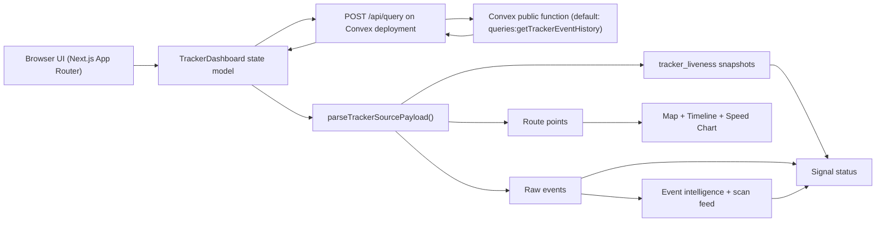

# Tracker Route Dashboard

Production-grade GPS telemetry dashboard built with Next.js, shadcn/ui, MapLibre, and Recharts.

It visualizes historical route points from a Convex public query, supports incremental sync, understands both legacy point payloads and the new `raw_events`/`tracker_liveness` model, and provides map-level telemetry inspection with unit conversion (MPH/KM/H).

## Why This Project Exists

This dashboard is designed for real-world tracker operations where data quality and latency vary:

- GPS fix records and heartbeat-only records can arrive in the same stream.
- Schemas can vary between devices or backend revisions.
- The UI must stay responsive during periodic sync without map reset jitter.
- Operators need route context, speed context, and signal-health context in one place.

## Core Features

- Time-window route filtering with date + hour controls.
- Preset windows (`Last 1h`, `Last 6h`, `Last 24h`, `Last 7d`).
- Interactive map with:
  - clustered points
  - zoom-to-cluster behavior
  - robust point selection fallback (pixel-nearest)
  - telemetry popup per selected point
- Raw-ingest intelligence:
  - event-type breakdown (`gps_fix`, `gps_cell_fallback`, `gps_no_fix`, `heartbeat`, `ble_scan`, `rfid_scan`)
  - ingest lag KPIs
  - recent BLE/RFID feed
- Signal classification:
  - `GPS available`
  - `Cell fallback`
  - `Beacon activity`
  - `Heartbeat only`
  - `Disconnected`
- Last no-fix/heartbeat card using raw event semantics.
- Contract metadata chip when `/contract/version` is available.
- Speed analytics chart.
- Incremental sync strategy with safe fallback to full refresh.
- Convex data source configuration from in-app settings panel.

## Stack

- Framework: `Next.js 16` + `React 19`
- UI: `shadcn/ui` + `radix-ui` primitives
- Styling: `Tailwind CSS v4` + custom dashboard design tokens
- Map: `react-map-gl` + `maplibre-gl`
- Charts: `recharts`
- Date handling: `date-fns`

## Architecture Overview



## Data Contract

The UI calls Convex via HTTP:

- Endpoint: `POST {NEXT_PUBLIC_CONVEX_URL}/api/query`
- Body:

```json
{
  "path": "queries:getTrackerEventHistory",
  "args": {
    "trackerId": "pi-5-gateway-01",
    "limit": 500
  },
  "format": "json"
}
```

During background incremental sync, the dashboard appends the right cursor key for the active query (`startTrackerTsMs` for `queries:getTrackerEventHistory`):

```json
{
  "trackerId": "pi-5-gateway-01",
  "limit": 500,
  "startTrackerTsMs": 1771249200000
}
```

If incremental args are unsupported, the dashboard retries with a full query automatically.

### Example Convex query for `parcel-tracker-convex`

The backend included in this bundle already exposes `queries:getTrackerEventHistory`. The example below is mainly useful when adapting the dashboard to another Convex project that has ingest tables but no dashboard query yet:

```ts
import { query } from "./_generated/server";
import { v } from "convex/values";

export const getRawEvents = query({
  args: {
    trackerId: v.optional(v.string()),
    limit: v.optional(v.number()),
    sinceTs: v.optional(v.number()),
  },
  handler: async (ctx, args) => {
    const limit = Math.max(100, Math.min(args.limit ?? 1500, 5000));

    const events = await ctx.db
      .query("raw_events")
      .withIndex("by_tracker_ts", (q) => {
        if (!args.trackerId && !args.sinceTs) return q;
        if (args.trackerId && args.sinceTs) return q.eq("trackerId", args.trackerId).gte("trackerTsMs", args.sinceTs);
        if (args.trackerId) return q.eq("trackerId", args.trackerId);
        return q.gte("trackerTsMs", args.sinceTs!);
      })
      .order("desc")
      .take(limit);

    const liveness = args.trackerId
      ? (await ctx.db.query("tracker_liveness").withIndex("by_tracker", (q) => q.eq("trackerId", args.trackerId!)).take(1))
      : await ctx.db.query("tracker_liveness").take(25);

    return {
      events: events.reverse(),
      liveness,
    };
  },
});
```

Then set the dashboard **Public query path** to:

- `dashboard:getRawEvents`

## Payload Normalization Behavior

`src/lib/tracker.ts` now has a dual parser:

- `parseTrackerSourcePayload()` for:
  - new raw model (`raw_events`, `tracker_liveness`)
  - legacy point-only arrays
- `rawEventsToTrackerPoints()` to convert location-bearing raw events into map/chart points
- `deriveLivenessFromEvents()` fallback when explicit liveness rows are not returned

It still tolerates schema variance by checking aliases:

- Latitude keys: `lat`, `latitude`, `gpsLat`, `y`
- Longitude keys: `lng`, `lon`, `longitude`, `gpsLon`, `x`
- Speed keys: `speed`, `speedKmh`, `velocity`, `kmh`
- Timestamp keys: `timestamp`, `time`, `ts`, `createdAt`, `updatedAt`, `recordedAt`, `date`

Normalization guarantees:

- Output uses canonical `TrackerPoint`.
- Entries are sorted by timestamp.
- MPH input can be converted to KM/H.
- Missing speed can be approximated from geodesic distance and elapsed time.
- Heartbeat points (`lat=0 && lng=0`) are retained for connection-state logic but excluded from route rendering.

## Map Interaction Model

The map selection flow in `src/components/route-map.tsx` is designed for reliability:

1. Cluster click -> zoom in.
2. Unclustered feature click -> select by `pointId`.
3. Fallback -> select nearest point in pixel space within a threshold.

This avoids the common "dot clicked but no popup appears" issue when feature hit-testing is imperfect.

## Project Structure

```text
src/
  app/
    layout.tsx            # App shell + metadata
    page.tsx              # Root page entry
    globals.css           # Theme tokens + shared dashboard visual system
  components/
    tracker-dashboard.tsx # Main orchestration component (state, sync, UI composition)
    route-map.tsx         # Map rendering + interaction
    ui/                   # shadcn/ui primitives
  lib/
    tracker.ts            # Normalization + geospatial stats
    utils.ts              # className utility
```

## Configuration

Set in `.env.local` or adjust from the in-app **Data source** panel:

- `NEXT_PUBLIC_CONVEX_URL` (default: `https://your-deployment.convex.cloud`)
- `NEXT_PUBLIC_TRACKER_FUNCTION_PATH` (default: `queries:getTrackerEventHistory`)
- `NEXT_PUBLIC_TRACKER_FUNCTION_ARGS` (default: `{"trackerId":"pi-5-gateway-01","limit":500}`)

Example `.env.local`:

```bash
NEXT_PUBLIC_CONVEX_URL=https://your-deployment.convex.cloud
NEXT_PUBLIC_TRACKER_FUNCTION_PATH=queries:getTrackerEventHistory
NEXT_PUBLIC_TRACKER_FUNCTION_ARGS={"trackerId":"pi-5-gateway-01","limit":500}
```

## Local Development

```bash
npm install
cp .env.example .env.local
npm run dev
```

Open `http://localhost:3000`.

## Quality Commands

```bash
npm run lint
npm run build
npm run start
```

## Deployment

This project is optimized for Vercel deployment:

```bash
vercel --prod
```

Ensure the same `NEXT_PUBLIC_*` variables are configured in Vercel project settings.

## Performance Notes

- Background polling is configurable (`refreshSeconds`).
- Incremental sync reduces payload size and avoids full reloads when backend supports `sinceTs`.
- Route map auto-fit is guarded so periodic sync does not continuously reset viewport.
- Clustering reduces point rendering pressure for long routes.

## Troubleshooting

### "Could not find public function ..."

Set `NEXT_PUBLIC_TRACKER_FUNCTION_PATH` or Data source path to a function that actually exists.

For the new raw ingest backend (`parcel-tracker-convex`), your query should return rows from:
- `raw_events` (event history)
- optionally `tracker_liveness` (last-seen snapshots)

Use the in-app **Use raw-events preset** shortcut as a starter, or query available functions via `queries:listPublicQueries`.

### No points on map but tracker is still active

This means your payload currently has no events with coordinates (for example only `heartbeat`, `gps_no_fix`, or scan events).  
The dashboard still shows liveness and event analytics, while map route remains empty.

### Popup not reopening after close

Map point selection uses popup remount keys + pixel-nearest fallback in `route-map.tsx`; confirm you are running latest deployment and hard-refresh.

## Security and Operational Notes

- This UI uses public Convex query endpoints by design.
- Do not expose sensitive/internal-only query paths in `NEXT_PUBLIC_*` env values.
- If multi-tenant, enforce server-side device scoping in Convex function logic.

## Changelog Discipline

For production operations, treat these areas as change-sensitive:

- `parseTrackerSourcePayload()` raw/legacy detection behavior
- incremental sync query arguments
- liveness + connection-state mapping
- map click/selection logic
- KPI calculation formulas

These affect operator trust and should be validated on real telemetry after each release.

## Cross-Repo Dependencies

This dashboard is one part of a 4-repository system:

In this publication bundle, those repositories are represented as numbered top-level folders.

1. `parcel-tracker-pi`
- Produces tracker events and sends them to Convex `POST /ingest`.

2. `parcel-tracker-contract`
- Defines the shared payload schema and contract version policy.

3. `parcel-tracker-convex`
- Validates and stores events in `raw_events` and `tracker_liveness`.
- Exposes query functions consumed by this dashboard.

4. `TrackerDashboard` (this repo)
- Reads data via Convex public queries and renders map/timeline/health UI.

Detailed integration notes are documented in:
- `docs/SYSTEM_DEPENDENCIES.md`
