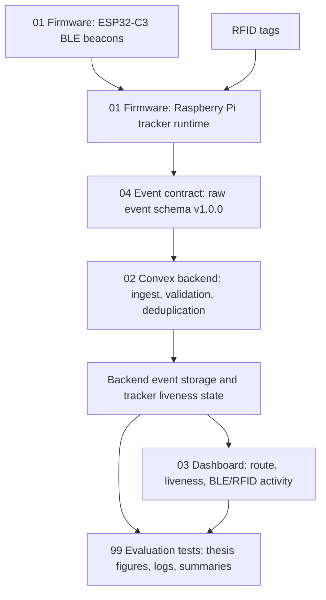

# Parcel Visibility Prototype

This repository contains the implementation and evaluation material for a parcel visibility prototype. The system combines BLE beacons, RFID tags, a Raspberry Pi tracker, a Convex backend, and a dashboard for visualizing tracker state and event history.

## Demo

https://github.com/user-attachments/assets/6a2cfb43-896b-42e5-becb-74697fe3852c

[Download the demo video for playback with audio](https://github.com/louis-co/parcel-visibility-prototype/raw/refs/heads/main/docs/media/parcel-visibility-demo.mov).

The repository also keeps a compact WebM copy at `docs/media/parcel-visibility-demo.webm`.

## System Overview

## Repository Map

| Folder | Role | Main contents |
| --- | --- | --- |
| `01_firmware_tracker_beacon/` | Device-side implementation | Raspberry Pi tracker runtime services for GNSS/cellular fallback, BLE, RFID, LTE initialization, resource monitoring, plus ESP32-C3 BLE beacon firmware variants. |
| `02_convex_backend/` | Backend implementation | Convex HTTP ingest endpoint, raw event validation, deduplication, tracker liveness state, schema, and dashboard-facing queries. |
| `03_tracker_dashboard/` | Dashboard application | Next.js dashboard with map-based route visualization, liveness summaries, BLE/RFID activity views, and configurable Convex data source settings. |
| `04event_contract/` | Shared data contract | Contract version, raw tracker event JSON Schema, and example event payloads. |
| `99_eval_tests/` | Evaluation evidence | BLE, RFID, road-test, backend, dashboard, and tracker runtime test data, including CSV/JSON summaries, rendered figures, and selected raw logs. |

## System Flow

1. BLE beacons advertise UUID-like identifiers.
2. The Raspberry Pi tracker reads BLE advertisements, RFID tags, GNSS/cellular location data, and runtime health state.
3. The tracker sends contract-compatible raw events to the Convex backend through `POST /ingest`.
4. Convex validates, deduplicates, stores, and exposes the event data.
5. The dashboard queries Convex and visualizes route, liveness, and event activity.

## Main Event Types

The shared event contract currently covers:

- `heartbeat`
- `gps_fix`
- `gps_no_fix`
- `gps_cell_fallback`
- `ble_scan`
- `rfid_scan`

The active contract version is `1.0.0`.

## Quick Start Pointers

- Start with `01_firmware_tracker_beacon/README.md` for tracker and beacon code.
- Use `02_convex_backend/README.md` for backend setup, deployment, endpoints, and query names.
- Use `03_tracker_dashboard/README.md` for dashboard setup and configuration.
- Use `04event_contract/README.md` for the raw event schema.
- Use `99_eval_tests/` together with the repository map above to navigate the evaluation evidence.

## Notes

This repository is organized as a publication-ready bundle rather than a single deployable monorepo. Each numbered implementation folder keeps its own setup instructions and runtime assumptions.
